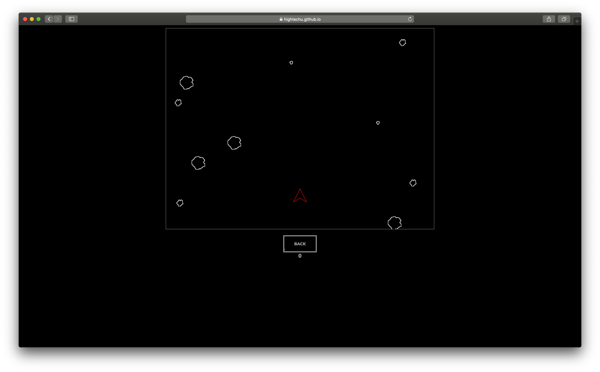
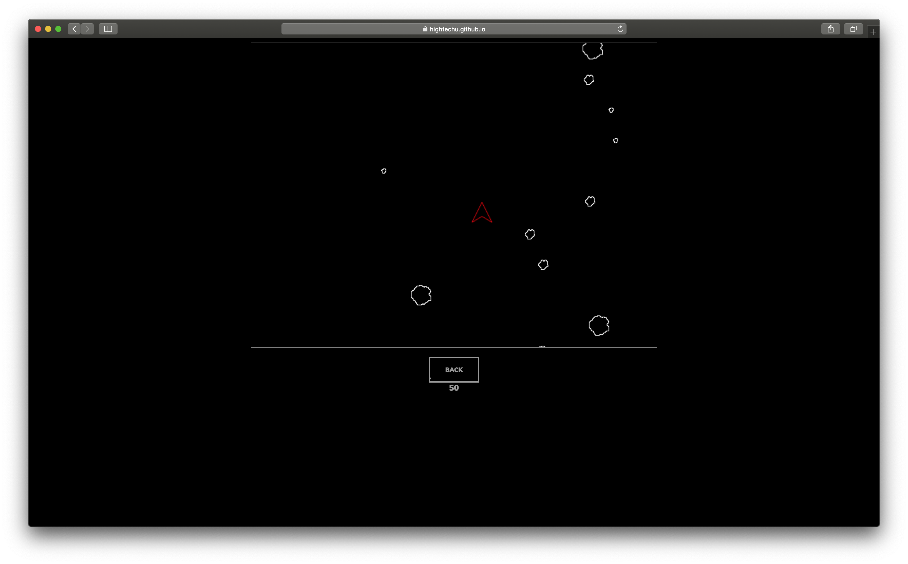

# Open Space

**2019 HighTechU Academy - Cohort 1**

## Website

https://hightechu.github.io/hightechu-academy-openspace/

## Problem Statement

Problem: Daily life for most people who play videogames is stressful and busy, and most readily-available popular videogames contain tension or stress-inducing elements.

## User Stories

* As a user, I want a peaceful game so that I can relax during exam season.
* As a user, I want to be able to keep track of high scores so that I can compete with myself to get better at the game.
* As a user, I want a distraction-free webpage so that I can focus on the game more.

## Promo

## Made with:

* HTML
* CSS
* JS

## Made by:

* Avery
* Leo
* Luci
* Jonah
* Owen
